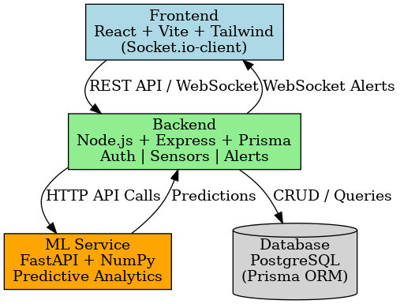

# 🌆 Smart City Management Platform


> 🚀 A full-stack capstone project built with **React, Node.js, PostgreSQL, and FastAPI ML microservices**.  
> Provides **real-time dashboards, alerts, and predictive analytics** for Smart City infrastructure.

---

## ✨ Features
- ✅ Role-based authentication (Admin, Operator, Viewer)  
- ✅ Real-time dashboards (Traffic, Air Quality, Waste Management)  
- ✅ Live alerts (threshold crossing → notifications)  
- ✅ Predictive analytics (ML anomaly detection)  
- ✅ Cloud-native (Docker, GitHub Actions CI/CD, GCP Cloud Run deployment)  
- ✅ Scalable repo structure (FAANG-level microservice mindset)  

---

## 🏗️ Architecture


---

## 🛠️ Tech Stack
**Frontend:** React + Vite + TypeScript + Tailwind CSS + Recharts  
**Backend:** Node.js + Express + TypeScript + Prisma ORM  
**Database:** PostgreSQL (Timescale for time-series) + Redis (cache, rate-limiting)  
**Real-time:** Socket.IO (WebSocket)  
**ML Microservice:** Python + FastAPI + scikit-learn  
**DevOps:** Docker, Docker Compose, GitHub Actions, GCP Cloud Run  
**Monitoring:** Prometheus + Grafana (optional)  

---

## 📂 Repository Structure
```bash
smartcity/
├── backend/         # Node.js + Express + TS + Prisma
├── frontend/        # React + Vite + TS + Tailwind
├── ml-service/      # Python FastAPI ML microservice
├── docs/            # SRS, ERD, API docs, demo guide
├── infra/           # K8s manifests / Terraform
├── docker-compose.yml
└── .github/workflows/ # CI/CD pipelines


⚡ Setup & Installation
git clone https://github.com/kartikbhardwaj2003/smartcity.git
cd smartcity

cp .env.example .env
docker-compose up --build

Services available at:

Frontend → http://localhost:5173

Backend → http://localhost:4000

ML Service → http://localhost:8000


📡 API Endpoints
POST /api/auth/register        → Register user
POST /api/auth/login           → Login & get JWT

POST /api/sensors              → Add sensor (Admin)
GET  /api/sensors              → List sensors
POST /api/sensors/:id/readings → Ingest reading
GET  /api/sensors/:id/readings → Query readings

GET  /api/alerts               → Fetch active alerts
POST /api/alerts/:id/resolve   → Resolve alert

GET  /api/dashboard/summary    → Aggregated metrics


📊 Database Schema

Core tables:

Users → id, email, password_hash, role

Sensors → id, type, location

SensorReadings → sensor_id, timestamp, value

Alerts → sensor_id, level, message

🤖 ML Microservice

Framework: FastAPI
Endpoint: /predict
Input: sensor readings
Output: anomaly score + prediction

Example Request:
POST /predict
{
  "sensor_id": "123",
  "value": 85.2
}

{
  "anomaly": true,
  "confidence": 0.92
}

🚀 Deployment

Local: Docker Compose

Cloud: GCP Cloud Run / Kubernetes (manifests in infra/)

CI/CD: GitHub Actions → auto build, test, deploy

🧪 Testing
npm run test         # backend
npm run test:e2e     # frontend
pytest               # ml-service

📖 Documentation

📂 docs/
 includes:

✅ SRS.md (Software Requirement Specification)

✅ API_Documentation.md (Postman collection included)

✅ ERD.png (Database schema)

✅ ArchitectureDiagram.png

✅ DEMO.md (Demo guide for viva presentation)

🌟 Future Enhancements

AI-powered traffic signal optimization

IoT sensor integration (MQTT/Kafka ingestion)

Predictive maintenance (time-series forecasting)

Multi-city dashboard federation

👨‍💻 Author

Kartik Bhardwaj
Capstone Project
www.linkedin.com/in/kartik-bhardwaj47-5b9728293
